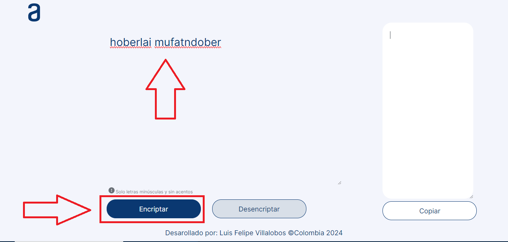

# Encriptador-Texto

# Encriptador de Mensajes

## Introducción
¡Bienvenidos al Encriptador de Texto! Este es un programa diseñado en base a el primer reto impuesto por Oracle Next Education mediante la plataforma de Formación Alura Latam para cifrar y descifrar mensajes de forma segura y confiable. En esta guía, te mostraremos cómo utilizar esta herramienta para proteger la privacidad de tus comunicaciones.

## ¿Cómo Funciona?
El Encriptador de Mensajes utiliza un algoritmo de cifrado para convertir el texto original en un formato ilegible, conocido como texto cifrado. Este texto cifrado solo puede ser decodificado utilizando las dos funcionalidades disponibles, ya sea para encriptarlo o desencriptarlo, eligiendo la opción mediante los botones:


De esta manera, tus textos estarán protegidos contra personas no autorizadas.

## Para tene presente

- Solo se aceptan minusculas y espacios.
- No se aceptan mayusculas.
- No se aceptan numeros
- No se aceptan caracteres especiales.

## Características Principales
- **Cifrado y Descifrado:** Convierte tus textos en texto cifrado para proteger tu privacidad, y luego descifra los textos para leerlos.
- **Fácil de Usar:** Interfaz intuitiva que te guiará a través del proceso de cifrado y descifrado en solo unos pocos pasos simples.
- **Se puede usar en cualquier dispositivo** Desde un celuar, tablet o computador podras usar la herramienta .

![Desktop.PNG]..(img/presentacion/Desktop.PNG)


## Cómo Utilizar
1. **Cifrar un Mensaje:**
   - Ingresa tu mensaje en el campo de texto proporcionado.

    
    
   - Haz clic en el botón "encriptar" para generar el mensaje cifrado.

    

   - Luego en la parte derecha visualizaras  el mensaje encriptado.

    


    

2. **Descifrar un Mensaje:**
   - Ingresa tu mensaje en el campo de texto proporcionado.

    
    
   - Haz clic en el botón "Desencriptar" para generar el mensaje cifrado.

    

   - Luego en la parte derecha visualizaras  el mensaje desencriptado.

    
### Boton copiar

Tu puedes usar clickear el boton copiar, para copiar el texto generado a tu portapapeles:


## Tecnologías utilizadas 

    - HTML5
    - CSS3
    - JavaScript

## Ejemplo de Uso
```plaintext
Texto Original: hola mundo

Texto Cifrado: [hoberlai mufatndober].

### Boton copiar


